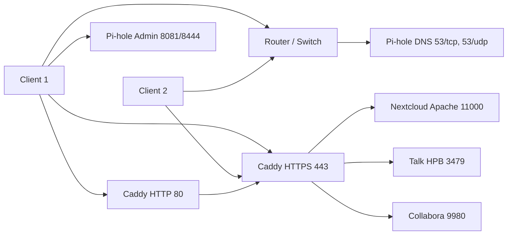

# Architecture: nextcloud-pihole-selfhosted

This document describes the high-level architecture of the self-hosted cloud stack built around Pi-hole and Nextcloud.  
It focuses on components, data flows, and stable design decisions rather than implementation details that may change frequently.

## Goals

- Provide a reproducible home lab stack for DNS, DHCP, and personal cloud services.
- Make Nextcloud and other services reachable via friendly, LAN-local hostnames.
- Keep configuration in Git and host-specific secrets in `.env` files, so rebuilding on a new machine is straightforward.

## Core components

### 1. Pi-hole (DNS/DHCP)

- Runs in Docker using the `pihole/compose.yaml` stack.
- Acts as the primary DNS server for the LAN and can optionally provide DHCP.
- Hosts local DNS records such as:
  - `your.cloud.name` → Host IP (reverse proxy + Nextcloud host).
- Uses environment variables from `pihole/.env` (for example `TZ`, Pi-hole web password).
- Typical container ports:
  - `53/tcp`, `53/udp` – DNS
  - `80/tcp` (mapped to host, e.g. `8081`) – HTTP Pi-hole admin
  - `443/tcp` (mapped to host, e.g. `8444`) – HTTPS Pi-hole admin

### 2. Nextcloud (AIO)

- Runs in Docker using the `nextcloud/` stack (Nextcloud All-in-One).
- Provides personal cloud storage, file sync, and collaboration features.
- Typically exposes an internal Apache HTTP endpoint on `127.0.0.1:11000` on the host.
- Uses `nextcloud/.env` to define values such as:
  - `NEXTCLOUD_DOMAIN` (LAN-local hostname, e.g. `your.cloud.name`)
  - Host IP (LAN IP of the machine running Nextcloud)
- Relies on Pi-hole for DNS resolution of its own hostname and other services.

### 3. Reverse proxy (Caddy)

- Runs in Docker using `nextcloud/reverse-proxy/compose.yaml`.
- Terminates HTTPS for `your.cloud.name` and routes traffic to Nextcloud and other upstreams.
- Typically runs with `network_mode: host` so it can bind directly to:
  - `80/tcp` – HTTP (redirect to HTTPS)
  - `443/tcp` – HTTPS
- Proxies to internal services on the host:
  - `127.0.0.1:11000` – Nextcloud AIO Apache
  - `127.0.0.1:3479` – Nextcloud Talk HPB (standalone-signaling)
  - `127.0.0.1:9980` – Collabora Online

## Network and DNS layout

- LAN IP range: e.g. `192.168.x.0/24`, with:
  - **Pi-hole IP** – IP of the host running the Pi-hole container.
  - **Host IP** – IP of the host running Nextcloud AIO and Caddy (may be the same as Pi-hole IP).
- Pi-hole is the primary DNS server for clients:
  - Router DNS is set to **Pi-hole IP**, or
  - Pi-hole provides DHCP and hands out its own IP as DNS, or
  - Clients are manually configured to use **Pi-hole IP** as DNS.

Example local DNS records in Pi-hole:

- `your.cloud.name` → **Host IP**

These records allow clients to reach services by stable hostnames rather than raw IPs.

## Detailed architecture diagram (with ports)

Reading the diagram:

- Clients use Pi-hole for DNS lookups.
- `your.cloud.name` resolves to **Host IP**.
- Clients connect to Caddy on ports 80/443.
- Caddy proxies traffic to the appropriate internal service based on the path and hostname.
- Pi-hole’s web UI is reachable on the mapped admin ports (e.g. 8081/8444).

## Data and request flow

A typical HTTPS request from a client to Nextcloud flows as follows:

1. Client (browser) requests `https://your.cloud.name/`.
2. The client’s DNS resolver queries Pi-hole:
   - Pi-hole returns **Host IP** for `your.cloud.name`.
3. The client opens a TCP connection to `Host IP:443`:
   - Caddy terminates TLS for `your.cloud.name`.
   - Caddy matches the request and forwards it to `127.0.0.1:11000` (Nextcloud Apache).
4. Nextcloud responds via Caddy back to the client.

For Nextcloud Talk and Collabora:

- Talk clients hit `https://your.cloud.name/standalone-signaling/...` which Caddy forwards to `127.0.0.1:3479`.
- Office documents are loaded via `/cool/...` which Caddy forwards to `127.0.0.1:9980`.

## Configuration and reproducibility

- All Docker Compose files (`pihole/compose.yaml`, `nextcloud/compose.yaml`, `nextcloud/reverse-proxy/compose.yaml`) are stored in Git.
- Host-specific values and secrets live in `.env` files:
  - Committed `.env.example` files document required variables with safe example values.
  - Real `.env` files are created per host and excluded from version control.
- Rebuilding the stack on a new host is done by:
  - Cloning the repo.
  - Copying `.env.example` to `.env` in each component directory.
  - Editing `.env` values for the new host (IPs, domains, passwords).
  - Running `docker compose up -d` for Pi-hole, Nextcloud AIO, and the reverse proxy in that order.

## Invariants and design decisions

These are the stable assumptions the architecture relies on:

- Pi-hole is the primary DNS server for the LAN.
- Local DNS records in Pi-hole map service hostnames (for example `your.cloud.name`) to the correct LAN IPs.
- Nextcloud AIO and the reverse proxy are deployed via Docker Compose and run on the same host (or a well-known host).
- Environment variables are used to keep configuration flexible and host-specific without editing the Compose files for each deployment.
- Secrets (passwords, keys) are never stored directly in Git; they live in `.env` files on each host.

## Future extensions

The architecture is intended to be extended with:

- Additional services fronted by the same Caddy reverse proxy and registered in Pi-hole DNS.
- Monitoring and observability (for example Netdata, Prometheus/Grafana, Uptime Kuma) on the same or another host.
- CI/CD checks that validate DNS records, container health, and basic connectivity after each change or redeploy.
