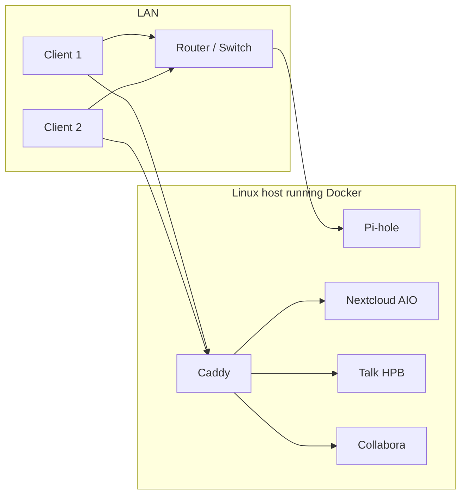

# nextcloud-pihole-selfhosted

Self-hosted Pi-hole DNS and Nextcloud stack for a home lab on a Linux host, orchestrated with Docker Compose.

## Overview

This repository defines a reproducible, self-contained cloud environment built around Pi-hole for DNS (and optional DHCP) and Nextcloud All-in-One (AIO) for personal cloud storage and collaboration.  
Pi-hole provides DNS and ad-blocking for your LAN, while Nextcloud and a Caddy reverse proxy run alongside it on the same host.

### Key features

- Pi-hole deployed via Docker Compose as the primary LAN DNS and optional DHCP.
- Configuration via `.env` files for all secrets and host-specific values (Pi-hole admin/API password, Nextcloud domain, host IPs).
- Local DNS records for Nextcloud and internal services (for example `your.cloud.name`).
- Designed to work even when the ISP router is “locked” by using Pi-hole DHCP and per-client DNS overrides.
- Git-tracked configuration and docs so the stack can be rebuilt consistently on new hosts.

## Architecture

The project is split into focused components:

- `pihole/` – Pi-hole Docker Compose stack and `.env.example`.
- `nextcloud/` – Nextcloud AIO and related configuration.
- `nextcloud/reverse-proxy/` – Caddy reverse proxy that fronts Nextcloud (and optional services like Talk HPB and Collabora).
- `update.sh` – Helper script for updating the Pi-hole stack on an existing host.

Pi-hole is typically deployed first; once DNS is in place, Nextcloud and the reverse proxy use Pi-hole for name resolution and serve friendly hostnames to clients.

## Repository layout

| Path                     | Description                                                              |
|--------------------------|--------------------------------------------------------------------------|
| `pihole/`                | Pi-hole Docker Compose stack and Pi-hole runtime volumes.               |
| `nextcloud/`             | Nextcloud AIO configuration and supporting files.                       |
| `nextcloud/reverse-proxy/` | Caddy reverse proxy configuration (`compose.yaml`, `Caddyfile`).     |
| `README.md`              | Overview and quick-start guide (this file).                             |
| `update.sh`              | Script to update the Pi-hole stack on an existing host.                 |

## Architecture diagram



This diagram shows LAN clients sending DNS queries through Pi-hole and HTTPS traffic through Caddy, which proxies to Nextcloud AIO, Talk HPB, and Collabora on the same host.

## Prerequisites

On the target host (for example Ubuntu Server):

- A user with `sudo` access.
- Docker Engine and Docker Compose installed.
- A static **Host IP** on your LAN.
- Basic familiarity with editing `.env` files and using `docker compose`.
- A LAN where you can either:
  - Set DNS to the **Pi-hole IP** on the router, or  
  - Use Pi-hole’s DHCP server and/or per-device DNS overrides.

## Quick start: Pi-hole only

These steps bring up Pi-hole as DNS/DHCP and give you a working foundation for the rest of the stack.

1. Clone the repository and enter it:

   ```bash
   git clone https://github.com/Deluk47/nextcloud-pihole-selfhosted.git
   cd nextcloud-pihole-selfhosted
   ```

2. Prepare the Pi-hole environment:

   ```bash
   cd pihole
   cp .env.example .env
   nano .env   # set TZ and FTLCONF_webserver_api_password (or WEBPASSWORD)
   ```

   - `TZ` should match your timezone (for example `Europe/London`).
   - The Pi-hole password variable becomes your Pi-hole web UI password.

3. Start Pi-hole with Docker Compose:

   ```bash
   docker compose up -d
   ```

4. Point clients to Pi-hole for DNS:

   - Set the **Pi-hole IP** as DNS on your router, or  
   - Enable Pi-hole DHCP and point clients at Pi-hole for DNS, or  
   - Manually configure DNS per client (IPv4 settings → DNS server = **Pi-hole IP**).

5. Log into the Pi-hole web UI and add local DNS records for your services, such as:

   ```text
   your.cloud.name -> Host IP
   ```

## Full stack: Pi-hole + Nextcloud + Caddy

To build the full stack on a new machine:

1. Clone the repository:

   ```bash
   cd ~
   git clone https://github.com/Deluk47/nextcloud-pihole-selfhosted.git
   cd nextcloud-pihole-selfhosted
   ```

2. Set up Pi-hole (DNS/DHCP foundation):

   ```bash
   cd pihole
   cp .env.example .env
   nano .env   # set TZ and Pi-hole password
   docker compose up -d
   ```

3. Set up Nextcloud AIO (follow official docs for the core AIO container), then configure `.env` in `nextcloud/` if you use one for host/domain values, for example:

   ```bash
   cd ../nextcloud
   cp .env.example .env   # if present
   nano .env              # set values like NEXTCLOUD_DOMAIN, Host IP, etc.
   # start your Nextcloud AIO stack as documented in this folder
   ```

4. Set up the Caddy reverse proxy:

   ```bash
   cd nextcloud/reverse-proxy
   # ensure compose.yaml and Caddyfile match your ports and domain
   docker compose up -d
   ```

   In the typical setup, Caddy:

   - Listens on host ports 80 and 443.
   - Serves `https://your.cloud.name` with an internal CA.
   - Proxies:
     - `/` → Nextcloud AIO Apache (e.g. `127.0.0.1:11000`)
     - `/standalone-signaling/*` → Talk HPB (e.g. `127.0.0.1:3479`)
     - `/cool/*` → Collabora (e.g. `127.0.0.1:9980`)

5. Wire DNS to the cloud host:

   - Ensure Pi-hole has a local DNS record that maps `your.cloud.name` to **Host IP**.
   - Point your LAN devices (or router) to use **Pi-hole IP** for DNS.

6. Access Nextcloud from a LAN client:

   ```text
   https://your.cloud.name
   ```

## DNS notes

- `your.cloud.name` should resolve to **Host IP** via:
  - Pi-hole Local DNS Records, or  
  - `/etc/hosts` entries on your clients, for example:
    ```text
    Host IP your.cloud.name
    ```
- For long-term stability, consider using a `.lan`, `.home`, or similar suffix (for example `cloud.lan`) instead of `.local`, which is reserved for mDNS on many systems.

## Environment files and configuration

Each component uses `.env` files to keep secrets and host-specific details out of version control:

- `pihole/.env` – Contains `TZ`, Pi-hole password variables, and other Pi-hole envs.
- `nextcloud/.env` – (Optional) Contains values like `NEXTCLOUD_DOMAIN`, host IP, etc.
- `nextcloud/reverse-proxy/.env` – (Optional) Contains domain and proxy-specific variables.

A matching `.env.example` is committed for each component with safe example values only.  
Copy `.env.example` to `.env` and edit locally before running `docker compose up -d`.

## Security and exposure

- This stack is designed for **LAN-only** access by default.
- Do not expose:
  - Pi-hole admin ports (for example `8081`/`8444`)
  - Nextcloud AIO admin port (for example `8080`)
  directly to the internet.
- If you plan to expose `https://your.cloud.name` publicly, consider:
  - Using a proper public domain and trusted certificate.
  - Placing a firewall or reverse proxy in front of the host.
  - Applying Nextcloud hardening recommendations.

## Troubleshooting

Common issues you may encounter:

- Docker pulls failing when DNS is misconfigured.
- Local domain not resolving correctly (Pi-hole record missing or clients not using Pi-hole).
- Caddy restarting in a loop due to an invalid `Caddyfile`.

Useful diagnostics:

```bash
# DNS and host resolution
dig your.cloud.name +short
ping -c 1 your.cloud.name
getent hosts your.cloud.name

# Port and service checks
ss -ltnp
docker ps
docker logs caddy --tail 50
```

If something breaks, check:

- That Pi-hole is up and you are using **Pi-hole IP** for DNS.
- That `your.cloud.name` resolves to **Host IP**.
- That the Caddyfile matches your actual Nextcloud/Talk/Collabora ports.
